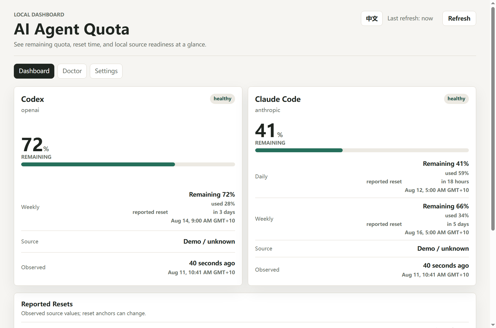
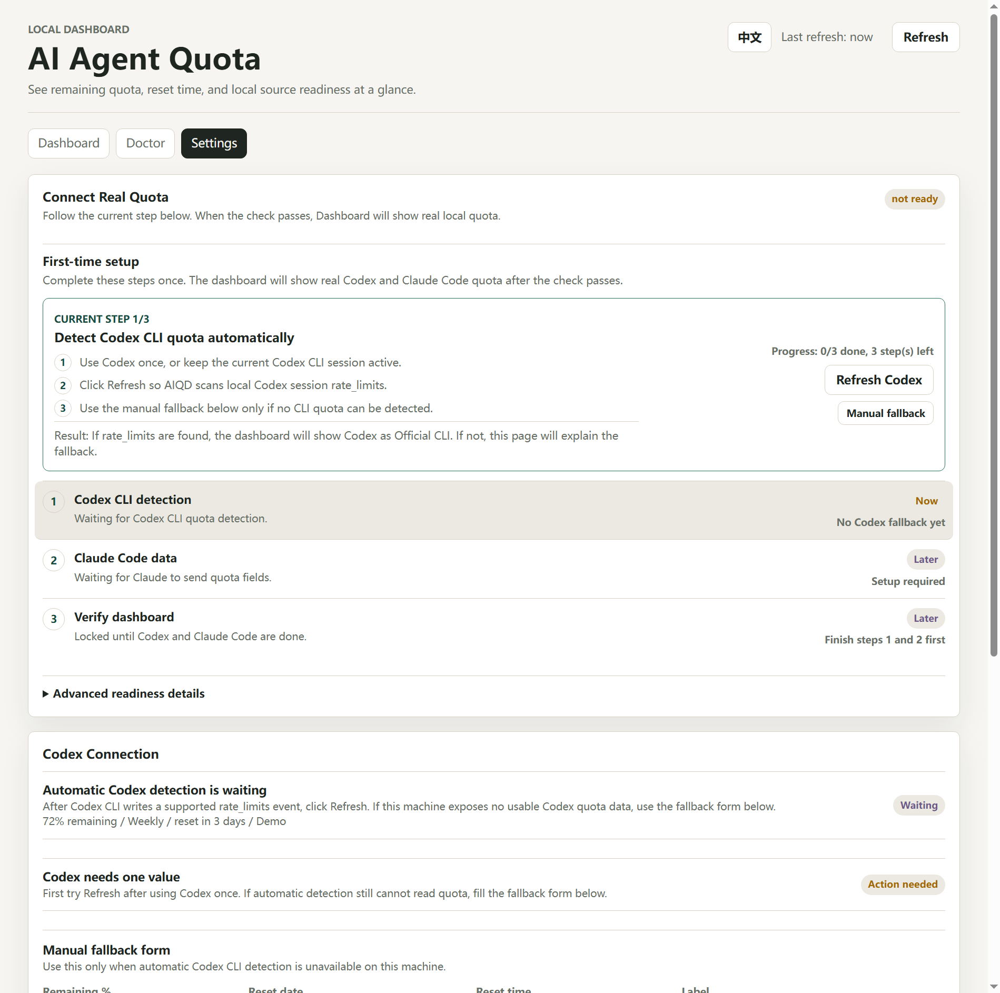
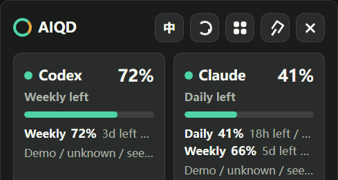

# AI Agent Quota Dashboard

[](https://github.com/isToniLiu/ai-agent-quota-dashboard/actions/workflows/ci.yml)
[](LICENSE)

A local-first, quota-first dashboard for AI coding agents.

Open the dashboard and see, within a few seconds, how much quota is left for Codex and Claude Code, when it resets, and how reliable the source is.

Unlike general token or cost trackers, this project is quota-first. It focuses on remaining limits, reported reset times, and source confidence for local AI coding agents.

## Status

This repository is at the v0.1 developer-preview stage. The first public preview is a source-only developer preview for technically comfortable early testers. The core MVP is implemented enough for local real-data dogfooding, while packaged installers, signed releases, and auto-start are intentionally left for a later release.

See [docs/status.md](docs/status.md) for the current project snapshot. The current app includes:

- Local Node.js service bound to `127.0.0.1`
- SQLite storage using Node's built-in `node:sqlite`
- Codex and Claude Code adapter boundaries
- Fixture-driven parsers for Claude Code statusline rate limits
- A conservative Codex parser for explicit structured quota snapshots
- Automatic Codex CLI `rate_limits` detection when supported structured local events are available
- Manual Codex snapshot command and Settings form for visible `/status` or Usage values
- Settings view status for Codex CLI quota detection with a manual fallback
- Settings real-data overview for first-run Codex and Claude Code setup
- Real-data desktop trial guide for Codex and Claude Code setup
- Doctor first-run checklist for real-data readiness
- Setup refresh feedback for Codex saves, Claude Code waiting state, and manual refreshes
- Settings view strict real-data trial readiness from the same checks as `trial:ready`
- Claude Code statusline setup helper with explicit opt-in
- Reset event timeline for changed reset anchors and sharp replenishment
- Dashboard reset display with relative and absolute reported reset times
- Dashboard data freshness display with observed timestamps and freshness reasons per agent
- Dashboard labels clarify remaining quota versus official pages that may show used quota
- Dashboard and Doctor views
- Mini panel page for tray-sized quota checks
- Electron desktop shell with a tray mini panel and optional always-on-top widget
- One-time desktop first-run guide that uses strict trial readiness to open the exact setup or Doctor section
- Desktop smoke coverage for the first-run guide deep-link and local state write
- Desktop startup diagnostics with recovery guidance for backend failures
- Desktop global shortcuts for AIQD mini panel, refresh, and widget actions
- Local trial scripts for desktop launch, Doctor, and Claude statusline self-test
- Real-data trial preflight command with source-specific next actions
- Strict real-data readiness check before desktop trials
- Settings view status for desktop shortcut bindings and overrides
- Tray menu actions for manual refresh, Doctor, Settings, and Dashboard
- Tray tooltip/menu status uses strict readiness before showing daily quota summaries
- Mini footer summary for the latest refresh result and warnings
- Mini strict readiness progress text for first-run Codex and Claude Code onboarding
- Clickable mini footer actions for refresh warnings and setup guidance
- Mini and tray first-run actions that open Settings or Doctor directly
- Mini first-run actions deep-link to the exact Settings or Doctor section
- Chinese/English language switching in the main dashboard and mini surfaces
- Dashboard guidance for missing quota data
- CLI `doctor` command for one-shot local diagnostics
- CLI export command for normalized JSON/CSV output
- Refresh history with saved counts and adapter error summaries
- Settings view for Claude Code statusline onboarding
- Claude Code statusline readiness checks for setup, shim, and latest rate limit data
- Claude Code real-data setup flow with a local statusline sink self-test
- Copy buttons for setup and local path commands, with selection fallback when clipboard access is unavailable
- Local `config.json` for user-configured agent data paths
- Normalized JSON/CSV export from the Settings view
- Explicit source and confidence labels
- Public dashboard API snapshots exclude account identifiers and raw local source references
- Demo data mode for UI development
- Local real-data mode hides persisted demo snapshots

If reliable quota data cannot be obtained from official or local user-visible sources, the app should show `unavailable`.

## Screenshots

Demo dashboard:



First-run setup flow:



Mini panel:



More release screenshot notes are in [docs/assets/screenshots](docs/assets/screenshots).

## Non-goals

This project does not:

- Read browser cookies
- Collect passwords
- Simulate logins
- Call private or hidden APIs
- Bypass rate limits
- Switch accounts to avoid limits
- Upload prompts, responses, source code, or chat content

## Quick Start

The first preview is source-only. Clone the repository, install dependencies, and run the local dashboard or desktop shell from source.

Demo mode:

```bash
npm install
npm run dev
```

Then open:

```text
http://127.0.0.1:4317
```

`npm run dev` enables demo data. To scan local paths without demo snapshots:

```bash
npm run dev:local
```

If demo snapshots were previously written to the local SQLite database, `npm run dev:local`, `doctor`, and `export` hide them unless demo mode is explicitly enabled.

Real local desktop trial from source:

```bash
npm install
npm test
npm run trial:preflight
npm run desktop:local
```

Expected result: `trial:preflight` either reports ready or prints the next source-specific action. The desktop first-run guide then opens the exact Settings or Doctor section needed for real data setup.

If Windows PowerShell blocks `npm` with `running scripts is disabled`, run the same commands with `npm.cmd`, for example `npm.cmd test` and `npm.cmd run desktop:local`.

See [docs/real-data-trial.md](docs/real-data-trial.md) for the full Codex and Claude Code checklist.

## Scripts

```bash
npm run dev        # local server with demo quota snapshots
npm run dev:local  # local server without demo quota snapshots
npm run desktop    # desktop tray app without demo quota snapshots
npm run desktop:local
npm run desktop:demo
npm run desktop:smoke
npm run desktop:first-run-smoke
npm run doctor
npm run trial:preflight
npm run trial:ready
npm run claude:self-test
npm run build      # compile TypeScript
npm test           # typecheck and run node:test tests
```

## Desktop Shell

The desktop shell is a lightweight Electron wrapper around the same local service and APIs.

```bash
npm run desktop
```

It starts the local backend, adds an AI Agent Quota tray icon, and provides:

- a tray mini panel that hides when it loses focus
- an optional always-on-top desktop widget
- a tray tooltip and menu summary for the current quota state
- strict readiness status in the tray when real-data setup is not reliable yet
- tray menu shortcuts for Refresh, Doctor, Settings, and Dashboard
- a one-time first-run guide that uses strict trial readiness to open the exact Settings or Doctor section when real data is not ready, or shows the mini panel when it is ready
- safe global shortcuts for AIQD itself: `Ctrl+Alt+Q` toggles the mini panel, `Ctrl+Alt+R` refreshes quota data, and `Ctrl+Alt+W` toggles the desktop widget
- compact per-window quota rows and manual refresh in mini surfaces
- single-instance behavior: launching the desktop app again focuses the existing mini panel
- automatic tray refresh when Claude Code sends the first statusline snapshot
- remembered desktop widget position
- `Esc` to hide the active mini surface
- a normal full dashboard window for setup, Doctor, and exports

The mini surfaces reuse the same normalized `/api/agents`, `/api/trial-readiness`, and setup endpoints as the main dashboard. They do not read extra files, collect prompts, or call hidden provider APIs.

Desktop shortcuts do not approve or automate other apps. Override or disable them with `AIQD_SHORTCUT_PANEL`, `AIQD_SHORTCUT_REFRESH`, and `AIQD_SHORTCUT_WIDGET`; set a value to `off` to disable that shortcut.

This is currently a development shell, not an installer. Auto-start, packaging, zip artifacts, and signed releases are intentionally left for a later release.

If the local backend cannot start, the desktop shell shows recovery guidance with the backend error tail and the same Doctor/smoke commands used in development.

Use `npm run desktop:smoke` to verify that the desktop shell can start the local backend and exit cleanly. Use `npm run desktop:first-run-smoke` to verify the first-run guide deep-link and local state marker against isolated temporary data.

## Doctor CLI

Run one local scan and print the same diagnostic signal without opening the dashboard:

```bash
node dist/index.js doctor
node dist/index.js doctor --demo
node dist/index.js doctor --json
node dist/index.js doctor --strict
```

The command prints refresh counts, each agent's quota or empty-state guidance, and the underlying Doctor checks. It exits with code `1` only for blocking failures such as adapter errors or invalid config. Missing quota sources are warnings because a freshly installed app may simply need setup.

Use `npm run trial:ready` or `doctor --strict` before a real-data desktop trial. Strict mode also requires fresh non-demo quota snapshots for every configured agent, so it fails when Codex or Claude Code still needs setup. The Settings real-data overview shows the same strict readiness result through `/api/trial-readiness`.

Use `npm run trial:preflight` when you want the shortest setup answer first. It runs one local refresh and prints source-specific next actions for Codex, Claude Code, and blocking Doctor issues without modifying external agent settings.

`--json` prints a machine-readable report that excludes account identifiers, raw source references, and raw content, redacts local paths, and includes per-snapshot freshness reasons. The plain text report is meant for local troubleshooting and can include local filesystem paths.

See [docs/diagnostics.md](docs/diagnostics.md) for what to share in public issues.

## CLI Export

Export normalized quota data without opening the dashboard:

```bash
node dist/index.js export
node dist/index.js export --csv
node dist/index.js export --json --no-refresh
```

The export command refreshes local sources by default. Use `--no-refresh` to export only the latest data already stored in SQLite. JSON output includes snapshots and reset events; CSV output includes latest quota snapshots. Both formats exclude account identifiers and raw local source references.

## Codex Quota Detection

AIQD first scans local Codex CLI session logs for supported `rate_limits` events. When those events are present, Codex quota is labeled `official_cli` and no manual copying is needed.

First action: use Codex once, then refresh AIQD or run `npm run trial:preflight`. If Codex CLI wrote supported local `rate_limits` data, no manual setup is needed.

The manual fallback command remains only for machines or Codex versions that do not expose usable local rate-limit events. To record a value you can visibly confirm:

```bash
node dist/index.js codex snapshot --remaining-percent 72 --reset-at 2026-08-16T03:00:00Z
```

You can also save the same visible values from the Settings view. The browser form writes only AIQD's own fallback file and refreshes the local dashboard after saving.

This writes a structured manual fallback snapshot to:

```text
~/.ai-agent-quota-dashboard/codex/codex-quota-snapshot.json
```

Manual Codex fallback snapshots are labeled `manual` and expire at the reported reset time.

The Settings view shows whether automatic CLI detection is active, whether a fallback exists, the latest remaining quota, the reported reset time, copyable fallback commands, and the fields that are stored or deliberately not stored.

## Local Data Paths

The app scans conservative default paths for supported agents. You can add explicit local scan roots without editing JSON by hand:

```bash
node dist/index.js config path list
node dist/index.js config path add codex "C:\path\to\codex-data"
node dist/index.js config path add claude-code "C:\path\to\claude-data"
node dist/index.js config path remove codex "C:\path\to\codex-data"
```

These commands write only the dashboard's own config file:

```text
~/.ai-agent-quota-dashboard/config.json
```

The Settings view shows the same config path, whether configured scan roots are readable, and copy buttons for the related commands. If the browser blocks clipboard access, the command is selected so it can be copied manually.

## Claude Code Statusline

Claude Code can send official `rate_limits` data to a local statusline command. This project provides a sink that stores only sanitized rate limit fields.

Real-data setup from source:

1. Build the local CLI:

```bash
npm run build
```

2. Test the local statusline sink with temporary files and fake `rate_limits`:

```bash
node dist/index.js claude-statusline-sink --self-test
```

3. Install the generated statusline command into `~/.claude/settings.json`:

```bash
node dist/index.js setup claude-statusline --write
```

4. Open Claude Code, then refresh the dashboard or run Doctor:

```bash
node dist/index.js doctor
```

Expected result: after Claude Code renders its statusline once, Doctor shows supported `rate_limits` windows. Until then it may show `Waiting for Claude Code data`.

If Doctor says the snapshot is old, open Claude Code once more so the statusline sends a fresh payload, then run `node dist/index.js doctor` again.

If Doctor says Claude Code CLI is installed outside `PATH`, use the full-path command shown by Settings or Doctor, or add that install directory to `PATH` and restart the terminal.

Preview without changing Claude settings: `node dist/index.js setup claude-statusline`.

If a `statusLine` already exists, the command refuses to replace it unless you add `--force`.

The Settings view shows the same setup state, readiness checks, latest received rate limit windows, snapshot age, and copyable commands. It is read-only: it does not modify Claude Code configuration from the browser.

Portable or test installs can override Claude setup paths with `AIQD_CLAUDE_SETTINGS_PATH`, `AIQD_CLAUDE_STATUSLINE_DIR`, and `AIQD_CLAUDE_STATUSLINE_SHIM_PATH`.

## Architecture

```text
src/
  adapters/   provider-specific discovery and parsing
  core/       quota models, confidence, state, forecast primitives
  storage/    SQLite persistence
  server/     localhost API and static file serving
desktop/      Electron tray panel and always-on-top widget shell
web/          dashboard UI
docs/         architecture, privacy, roadmap
```

The UI never reads local files directly. Adapters read allowed local sources, normalize them into `QuotaSnapshot` and `UsageEvent`, and the API serves only normalized data.

See [docs/data-sources.md](docs/data-sources.md) for the current parser trust boundaries.

## Source Confidence

Source priority:

```text
official_api / official_cli
> official_statusline
> local_quota_snapshot
> local_usage_log
> estimated
> manual
> unavailable
```

The product should be conservative: estimated data must be labeled as estimated, stale data must include a freshness reason, observed timestamps must be visible, and unknown data must not be presented as precise.

Persisted `demo` snapshots are visible only when demo mode is explicitly enabled.

## Reset Events

Some agents, especially Codex, can change their reported reset anchor because of banked resets, shared agentic usage pools, credits, promotions, or backend limit updates. The dashboard treats `resetAt` as an observed value, not a prediction, and shows both relative and absolute reported reset times.

When a reset time changes or remaining quota jumps back near full, the app records a reset event and shows it in the Recent Changes panel.

## Contributing

See [CONTRIBUTING.md](CONTRIBUTING.md) before adding an adapter or parser. Parser changes must include sanitized fixtures and tests.

Security and privacy-sensitive reports should follow [SECURITY.md](SECURITY.md). Do not paste prompts, responses, source code, credentials, cookies, session IDs, transcript paths, workspace paths, or full raw logs into public issues.

## Changelog

See [CHANGELOG.md](CHANGELOG.md).
