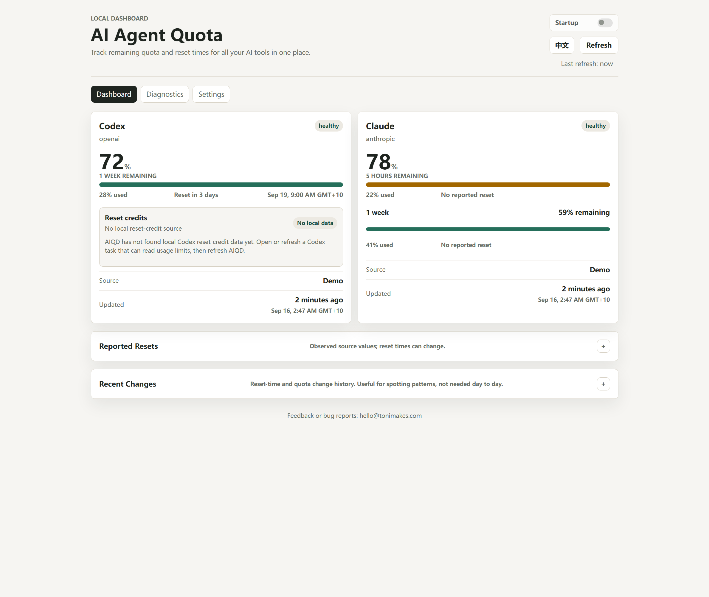
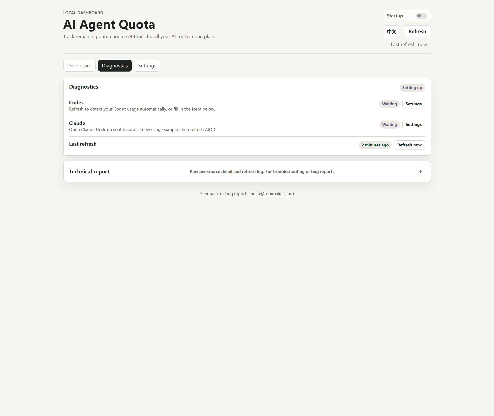
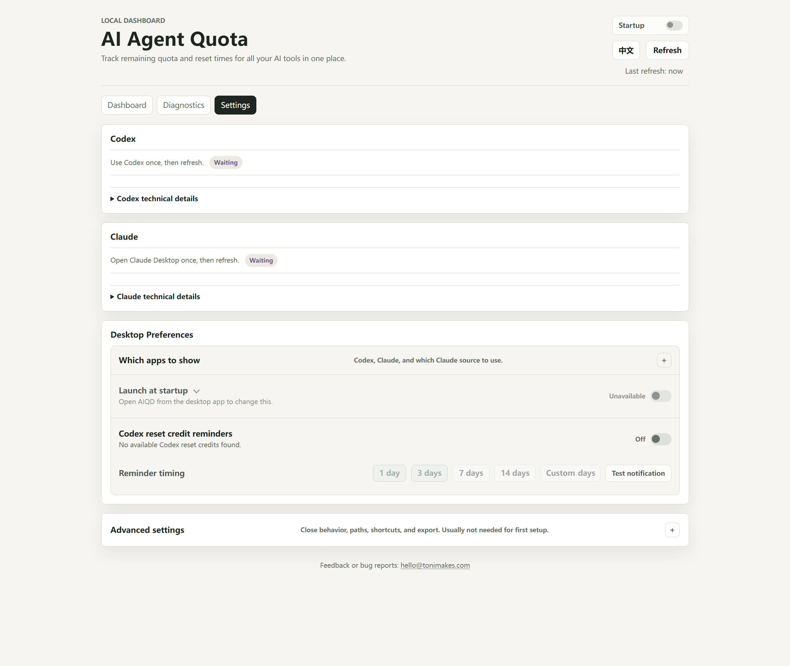
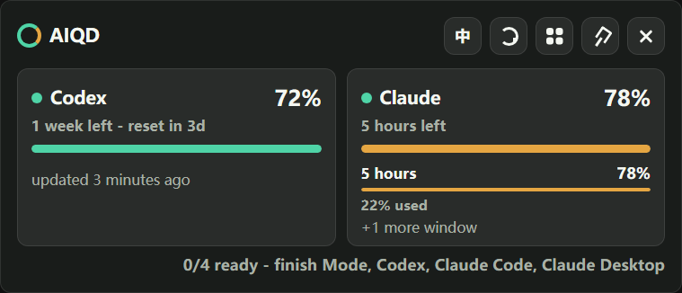
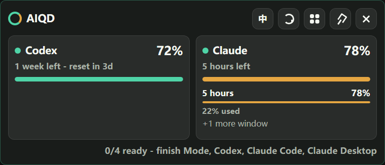

# AI Agent Quota Dashboard

[](https://github.com/ToniMakes/ai-agent-quota-dashboard/actions/workflows/ci.yml)
[](LICENSE)

**See your remaining AI coding quota and reported reset times in one local Windows app.** AIQD reads supported usage data already available on your device and shows when a source has no recent reading.

Project website: [aiqd.tonimakes.com](https://aiqd.tonimakes.com) · [Feedback](https://aiqd.board.fp-staging.tonimakes.com/board)

> **Current preview:** AIQD supports Codex and Claude through supported local desktop or CLI data sources. It does not monitor accounts used only in a web browser. Which quota values and reset times appear depends on the data each source provides. The current Windows x64 installer is [v0.1.0](https://github.com/ToniMakes/ai-agent-quota-dashboard/releases/tag/v0.1.0) and is unsigned; review the release page and verify its SHA256 before running it.

## What you can see

- Remaining quota and supported usage windows for Codex and Claude
- Reset times when a supported source reports them
- When the source last recorded data, and whether that reading needs a refresh
- Source connection guidance, refresh history, and observed reset changes
- A tray mini panel and optional always-on-top desktop widget

AIQD reports unavailable or stale data instead of guessing. A successful local check does not mean a provider has produced a new usage reading. For example, Claude Code data updates when Claude Code sends a new statusline reading.

## Screenshots

Screenshots use sanitized demo data. They are illustrative and may differ from the current release. They contain no account names, credentials, private paths, raw logs, prompts, source code, or real quota records.

| Dashboard | Connections |
| --- | --- |
|  |  |

| Settings | Tray mini panel | Desktop widget |
| --- | --- | --- |
|  |  |  |

See [screenshot notes](docs/assets/screenshots/README.md) for image safety details.

## Install the Windows preview

1. Download the Windows x64 installer from the [v0.1.0 release](https://github.com/ToniMakes/ai-agent-quota-dashboard/releases/tag/v0.1.0).
2. Run the installer and open **AI Agent Quota Dashboard** from the desktop shortcut.
3. Choose the tools you use in the first-run guide. For Claude, choose Claude Desktop or Claude Code CLI; you do not need both.
4. Follow the current step in **Settings**, then refresh AIQD to check for local usage data.

Claude Desktop users can open the desktop app once and refresh AIQD. Claude Code CLI users may need to connect the local statusline receiver, then open Claude Code and let it send a new usage reading. The app will explain the next step for the selected source.

The optional **Start AIQD when I sign in** installer setting is off by default. See [Distribution and Startup](docs/distribution.md) for details.

## Data sources and limits

AIQD reads only supported, quota-related fields from local data produced by tools you already use:

- **Codex:** supported local CLI rate-limit events. A clearly labeled manual fallback is available only in developer workflows.
- **Claude Code:** rate-limit data sent to AIQD's local statusline receiver.
- **Claude Desktop:** supported local plan-usage history, as an alternative to Claude Code.

Claude Desktop and Claude Code are alternative sources for the Claude card. AIQD does not read browser cookies or monitor browser-only use such as `claude.ai` or `chatgpt.com`. Some sources do not report a reset time, and local app or CLI formats may change. See [supported sources and data quality](docs/compatibility.md) for current details.

## Privacy

The desktop app stores quota readings and refresh history on your device and serves its dashboard through `127.0.0.1`. It does not collect passwords or browser cookies, or upload prompts, replies, source code, or chat content. It does not simulate logins, switch accounts, bypass rate limits, or call hidden provider APIs.

The public website is separate from the desktop app. Its feedback form sends the details and email address you choose to provide only when you submit feedback. Read the full [privacy notes](docs/privacy.md) and [security policy](SECURITY.md).

## Run from source

These steps are for developers. `npm run dev` starts the dashboard with demo data; it does not represent a connection to your provider accounts.

```bash
npm install
npm test
npm run dev
```

Open <http://127.0.0.1:4317>. To scan local paths without demo snapshots, use `npm run dev:local`. On Windows PowerShell, use `npm.cmd` if the execution policy blocks `npm`.

For a real-data local trial from source:

```bash
npm run trial:preflight
npm run desktop:local
```

## Documentation

| If you want to… | Read |
| --- | --- |
| Understand the current preview | [Project status](docs/status.md) |
| See supported sources and data-quality behavior | [Compatibility notes](docs/compatibility.md) and [data sources](docs/data-sources.md) |
| Connect local data or solve a setup issue | [Local data trial](docs/real-data-trial.md) and [diagnostics](docs/diagnostics.md) |
| Understand what is stored and where data goes | [Privacy](docs/privacy.md) |
| Build, test, inspect, or contribute | [Contributing](CONTRIBUTING.md), [architecture](docs/architecture.md), and [documentation index](docs/README.md) |
| Check the installer, startup, or signature | [Distribution](docs/distribution.md) and [code signing](docs/code-signing.md) |

## Non-goals

AIQD is a read-only quota dashboard. It does not read browser cookies, collect passwords, simulate logins, call private or hidden APIs, bypass rate limits, switch accounts to avoid limits, or upload prompts, responses, source code, or chat content.
